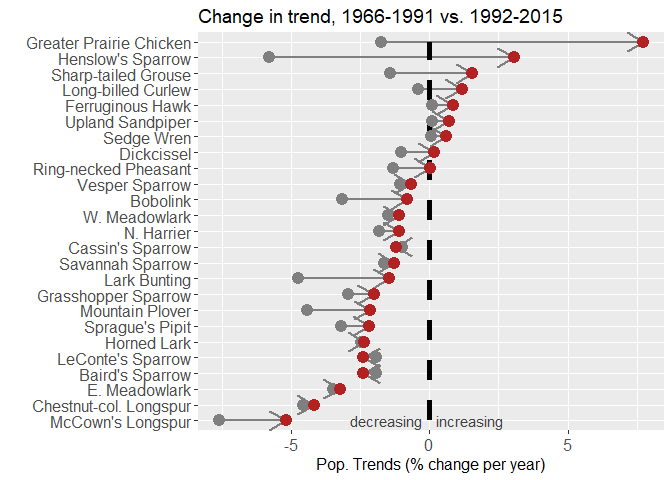

Make your own 'conserv-o-gram'
================

Purpose
=======

To summarize and visualize temporal changes in population trends for species of conservation concern.


Demo: Grassland birds in North America
======================================

Trend info from \# <https://www.mbr-pwrc.usgs.gov/cgi-bin/tf15.pl> (note: link not working at the moment!). This website provides custom estimates of population trends for a given time period based on a Bayesian hierarchical model of Breeding Bird Survey data.

Load the required libraries
===========================

If needed, install them first using, for example: install.packages("ggplot2")

``` r
library(ggplot2)
library(dplyr)
```

    ## 
    ## Attaching package: 'dplyr'

    ## The following objects are masked from 'package:stats':
    ## 
    ##     filter, lag

    ## The following objects are masked from 'package:base':
    ## 
    ##     intersect, setdiff, setequal, union

``` r
library(forcats)
```

    ## Warning: package 'forcats' was built under R version 3.5.3

Input the data
==============

Note: in this case 'historical' = 1966-1991, and 'recent' = 1992-2015. Customize with your own trend data from 'historical' and 'recent' periods of your choice.

``` r
conservogram =
  tibble(
    species = c(
      "Long-billed Curlew",
      "Cassin's Sparrow",
      "Sedge Wren",
      "Baird's Sparrow",
      "Lark Bunting",
      "Dickcissel",
      "W. Meadowlark",
      "LeConte's Sparrow",
      "Savannah Sparrow",
      "Horned Lark",
      "Bobolink",
      "Upland Sandpiper",
      "Ring-necked Pheasant",
      "Chestnut-col. Longspur",
      "Grasshopper Sparrow",
      "Vesper Sparrow",
      "N. Harrier",
      "E. Meadowlark",
      "Sprague's Pipit",
      "McCown's Longspur",
      "Henslow's Sparrow",
      "Mountain Plover",
      "Greater Prairie Chicken",
      "Sharp-tailed Grouse",
      "Ferruginous Hawk"
    ),
  
trend.historical = c(-0.40,-0.98,0.07,-1.92,-4.74,-1.04,-1.51,-1.93,-1.63,-2.47,-3.15,0.08,
                         -1.31,-4.56,-2.93,-1.06,-1.83,-3.48,-3.20,-7.6,-5.8,-4.42,-1.76,-1.43,0.09),
trend.recent = c(1.17,-1.21,0.62,-2.39,-1.46,0.18,-1.10,-2.39,-1.27,-2.35,-0.80,0.70,0.02,
                         -4.18,-2.01,-0.67,-1.10,-3.24,-2.18,-5.2,3.05,-2.14,7.73,1.54,0.84)
)
```

Make the graph
==============

``` r
x11(7,7) # this makes a custom plot area 'pop out' if desired (inches x inches)
conservogram %>%
  mutate(species = fct_reorder(species, trend.recent)) %>%
  ggplot() +
  geom_segment(aes(x = trend.historical, y = species, xend = trend.recent, yend = species), size = 1, 
               color = "gray50", arrow = arrow(length = unit(.5,"cm"))) +
  geom_segment(aes(x = 0, y = 1, xend = 0, yend = 25), size = 2, color = "black", linetype = 2) +
  geom_point(aes(x=trend.historical, y = species), size = 4, color = "gray50") +
  geom_point(aes(x=trend.recent, y = species), size = 4, color = "firebrick") +
  labs(x = "Pop. Trends (% change per year)", y = "") +
  labs(title = "Change in trend, 1966-1991 vs. 1992-2015") +
  theme(axis.text = element_text(size = 12), title = element_text(size = 12)) +
  annotate("text", x = c(-.25, .25), y = 1, 
           label = c("decreasing","increasing"),
           hjust = c(1,0), color = "gray25", size=4)
```



Save the graph
==============

You can save the last graph you made to a jpg or various other formats (just change the extension) using the following command. It will save to your working directory which you can view using: getwd()

``` r
ggsave("conservogram_grassland_birds.jpg")
```

    ## Saving 7 x 5 in image
